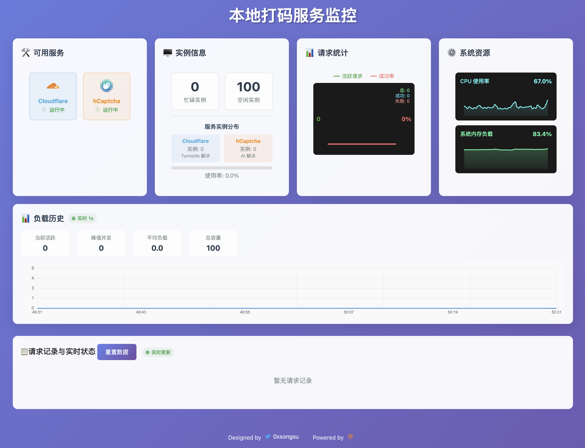

# CF Clearance Scraper

本地版本的 Cloudflare 保护绕过工具，支持 Turnstile 令牌生成、WAF 会话创建以及 hCaptcha AI 自动解决。

## 📸 项目展示

> 实时监控面板展示服务状态、性能指标和请求统计，支持 CPU、内存监控和双折线图表

## 版本信息

**当前版本：v1.0.3** 🚀

### 版本记录

| 版本 | 发布时间 | 主要更新 |
|------|----------|----------|
| **v1.0.3** | 2025-06 | ✨ 新增 hCaptcha 本地AI打码功能 🔑 支持多个 Gemini API 密钥轮换使用 ⚡ 优化内存管理和系统性能监控 📊 增强实时监控面板 🚀 完善一键部署脚本，支持Python环境自动配置 🛠️ 重构文档结构，提升用户体验 |
| **v1.0.2** | 2025-05 | 🔧 优化 Turnstile 解决算法 📈 改进监控系统稳定性 🐛 修复内存泄漏问题 |
| **v1.0.1** | 2025-04 | 🎯 初始版本发布 ✅ 基础 Cloudflare 绕过功能 📊 实时监控面板 |

## 致谢开发者

本项目基于以下优秀开源项目构建：

- [QIN2DIM/hcaptcha-challenger](https://github.com/QIN2DIM/hcaptcha-challenger) - hCaptcha AI解决方案
- [ZFC-Digital/cf-clearance-scraper](https://github.com/ZFC-Digital/cf-clearance-scraper) - Cloudflare绕过基础

## 支持功能

| 功能类型 | 支持状态 | 说明 |
|---------|---------|------|
| **Cloudflare Turnstile** | ✅ | 支持轻量级和完整页面模式 |
| **hCaptcha 自动解决** | ✅ | 基于 Google Gemini AI 模型 |
| **实时监控面板** | ✅ | 服务状态和性能指标监控 |
| **代理支持** | ✅ | HTTP/HTTPS 代理配置 |

## 文档指南

| 文档 | 功能说明 | 适用场景 |
|------|---------|----------|
| [📦 安装指南](docs/INSTALLATION.md) | 一键部署和手动安装步骤 | 初次使用 |
| [⚙️ 配置指南](docs/CONFIGURATION.md) | 统一配置系统和参数调优 | 环境配置 |
| [🔧 API 文档](docs/API.md) | 完整的接口使用说明和示例 | 开发集成 |
| [🤖 hCaptcha 指南](docs/HCAPTCHA.md) | AI验证码解决方案详解 | 验证码处理 |
| [📊 监控指南](docs/MONITORING.md) | 实时监控面板和性能分析 | 运维管理 |
| [🛠️ 故障排除](docs/TROUBLESHOOTING.md) | 常见问题诊断和解决方案 | 问题解决 |

## 免责声明

⚠️ 本工具仅用于测试和学习目的。使用者需对任何可能产生的法律责任承担责任。本库不意图对任何网站或公司造成损害，使用者对可能产生的任何损害承担责任。

## 许可证

ISC License - 详见 [LICENSE](LICENSE.md) 文件